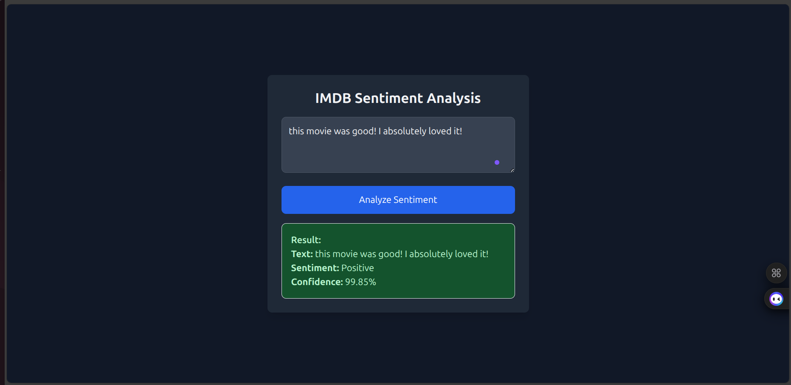

# IMDB Sentiment Analysis

This project demonstrates a full pipeline for sentiment analysis on IMDB movie reviews using **three deep learning models**: LSTM, a hybrid Conv1D-BI_LSTM model, and fine-tuned BERT. The best-performing model (**BERT**) is deployed using Flask with both a web interface and REST API.

---


| Model     | Accuracy | Best F1-Score |
|-----------|----------|---------------|
| **BERT**  | 98%      | 0.98          |
| LSTM      | 87%      | 0.87          |
| Hybrid    | 88%      | 0.88          |

**BERT was selected for deployment based on superior performance.**

*Full classification reports available in the `evaluation/` directory.*

---

## Pipeline Overview

1. **Data Preparation**
   - Cleaned and preprocessed IMDB dataset.

2. **Model Training**
   - Trained 3 models: LSTM, CNN-LSTM Hybrid, and BERT.

3. **Evaluation**
   - Used classification report and accuracy/F1-score to compare models.

4. **Best Model**
   - Fine-tuned `bert-base-uncased` using HuggingFace Transformers.
   - Final fine-tuning accuracy: `97.34%` | Val accuracy: `90.04%`.

5. **Custom Inference**
   - Inference pipeline includes input validation using NLTK for real-word filtering.

5. **Deployment**
    The project is fully deployed using Flask:
    - **Web Interface**: `GET /` — for users to test reviews directly.
    - **REST API**: `POST /predict` — accepts POST requests with JSON payloads.

---

## Web Interface



> Simple, responsive interface built with HTML and Tailwind CSS. Displays sentiment and confidence score clearly.

---

## How to Run Locally

```bash
# Step 1: Create a new environment
conda create -n imdb_env python=3.9
conda activate imdb_env

# Step 2: Install dependencies
pip install -r requirements.txt


# Step 3: Run the app
python app.py

# API Example
curl -X POST http://localhost:5000/predict \
     -H "Content-Type: application/json" \
     -d '{"text": "I absolutely loved this movie!"}'
```

## Model Download

To keep the repository lightweight and within GitHub limits, the fine-tuned **BERT model weights** are stored externally.

🔗 **Download fine-tuned BERT weights (.h5)**  
[Download from Google Drive](https://drive.google.com/uc?export=download&id=1EtyupFPlKpQ1FPkb8IvdJ_1bJ_KKdScZ)

Once downloaded, place the file here in your project directory:
```
models/fine_tuned_bert/tf_model.h5
```
Other required files for the BERT model are already included in the repository:

```
models/fine_tuned_bert/
│
├── config.json
├── special_tokens_map.json
├── tokenizer_config.json
└── vocab.txt
```

> With these files in place, the model will load and run as expected for both API and web interface.


Made with 💙 by **Alaa Eid**
GitHub: **@alaaeid2**
